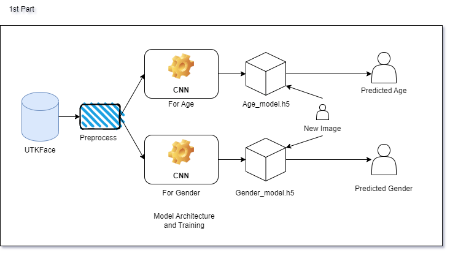
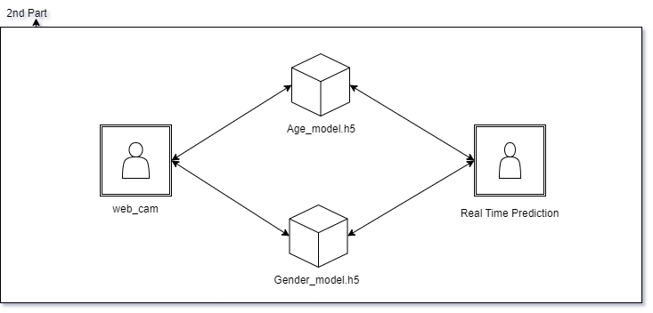

# Age and Gender Detection

A machine learning model that can predict a person's age and gender from a single image or video. The project is divided into two parts:

1. **Part 1**: A model trained on the UTKFace dataset, which consists of over 20,000 images of faces labeled with age and gender. This model uses deep learning techniques to extract features from the images and make accurate predictions.


2. **Part 2**: A real-time implementation of the model using a webcam or video feed. The model is trained on the same dataset as Part 1 and uses the same techniques, but it is optimized for real-time performance.

## Getting Started

These instructions will get you a copy of the project up and running on your local machine for development and testing purposes.

### Prerequisites

To run this project, you will need the following software and libraries:

- Python 3.6 or higher
- NumPy
- Pandas
- TensorFlow
- Keras
- OpenCV (for Part 2 only)

### Installing

1. Clone this repository to your local machine:
```https://github.com/KLAU-S/Zummit-InfoLabs-Intern```
2. Install the required libraries: 
```pip install numpy pandas tensorflow keras opencv-python```

## Authors

- **[Enayat Kareem, Brillia Benny, Swati Yadav, Avinash Kivande]** - *Initial work*

## License

Information about the project's license and any third-party libraries or assets that are used.

## Acknowledgments

- Any credits or acknowledgments for resources or inspiration that were used in the project.

